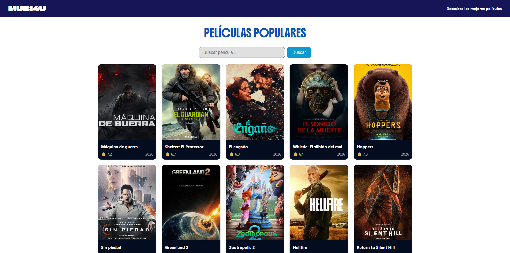
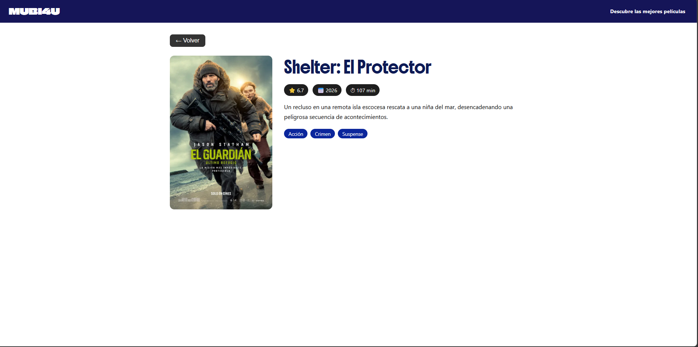
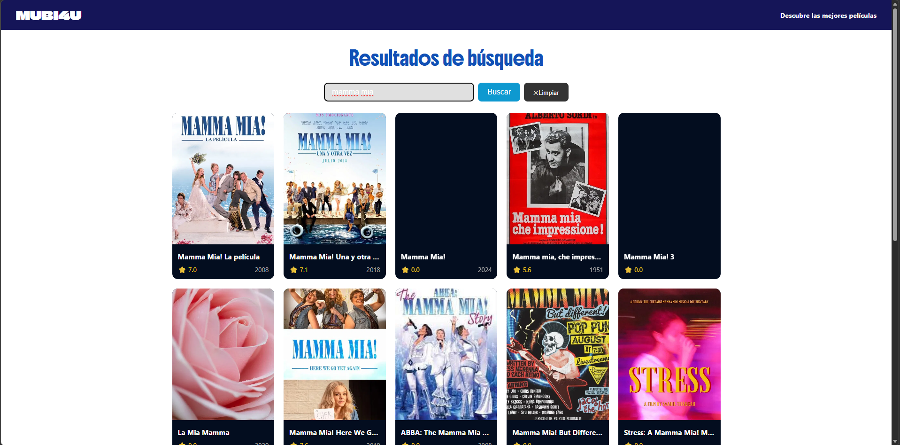

# MUBI4U

## API Used
**TMDB — The Movie Database**
- Website: https://www.themoviedb.org
- Documentation: https://developer.themoviedb.org/docs
- One of the largest and most complete public databases of movies and TV shows in the world.

---

## About the App
MUBI4U is a responsive web application where you can browse the latest and most popular movies currently in theaters. It pulls real-time data from The Movie Database (TMDB) API, displaying ratings, release dates, genres, and full descriptions. You can also search for any movie by name and click on it to see its full detail page.

---

## 📸 Screenshots

- Home page


- Movie page


- Search for movie

---

## Project Setup

### 1. Clone the repository
```
git clone https://github.com/YOUR_USERNAME/mubiforyou.git
cd mubiforyou
```

### 2. Install dependencies
```
npm install
```

### 3. Run for development
```
npm run serve
```
Then open http://localhost:8080 in your browser.

---

## 🌐 Live Demo
[View on Vercel](https://your-vercel-link.vercel.app)
